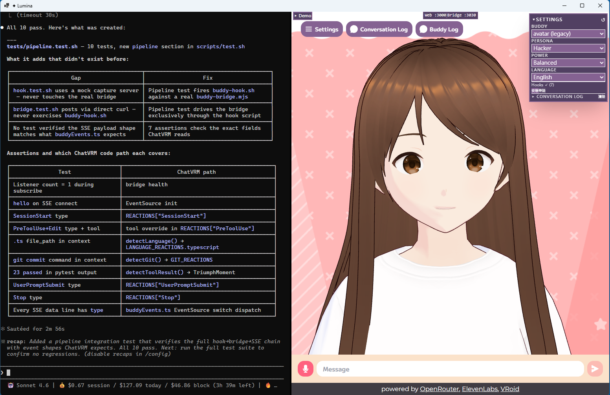

```
██╗     ██╗   ██╗███╗   ███╗██╗███╗   ██╗ █████╗
██║     ██║   ██║████╗ ████║██║████╗  ██║██╔══██╗
██║     ██║   ██║██╔████╔██║██║██╔██╗ ██║███████║
██║     ██║   ██║██║╚██╔╝██║██║██║╚██╗██║██╔══██║
███████╗╚██████╔╝██║ ╚═╝ ██║██║██║ ╚████║██║  ██║
╚══════╝ ╚═════╝ ╚═╝     ╚═╝╚═╝╚═╝  ╚═══╝╚═╝  ╚═╝
        > THE VISUAL LAYER FOR YOUR CODING AGENT <
```

# Lumina

> A 3D VRM buddy that reacts to your coding agent — **Claude Code, GitHub Copilot CLI, or OpenAI Codex CLI** — in real time, on WSL or Windows.

**English** &nbsp;·&nbsp; [繁體中文](README.zh-TW.md)



Hook events from any of three coding-AI CLIs → real-time reactions on a 3D character. Pick an agent, pick a runtime, pick a model, pick a personality. Watch it emote when the agent edits Python vs. Rust, hear it acknowledge `Edit` and `Bash` returns. Built on top of [ChatVRM](https://github.com/zoan37/ChatVRM) (MIT, pixiv Inc.) with a unified hook adapter that normalizes Claude / Copilot / Codex into one event taxonomy.

## What's different about this

Most "AI dev buddy" projects either roleplay through chat or visualize editor state. Lumina hooks into the **agent's actual tool execution events** — the same `PreToolUse`/`PostToolUse`/`Stop` callbacks each CLI fires — and routes them through a tiny SSE relay into a VRM avatar's expression and speech bubble. The avatar isn't pretending to react; it's reading the wire.

- **Three agents, one avatar.** Claude Code, GitHub Copilot CLI, and OpenAI Codex CLI all fire native hook events; one adapter (`buddy-hook.{sh,ps1}`) normalizes their per-agent stdin shapes into a single envelope. Pick once at startup from a 6-option dialog (3 agents × 2 runtimes — WSL or Windows-native).
- **Hook-driven, not prompt-driven.** Reactions fire 100% of the time, with sub-100 ms latency, regardless of whether the model "decides" to mention what it's doing.
- **Language-aware.** `Edit` on `app.py` triggers a different emote/line than the same edit on `lib.rs`. Mappings live in one file, easy to fork.
- **Result-aware.** Beyond knowing *what tool ran*, Lumina parses the **actual output** of test runners (`pytest`, `jest`, `cargo test`, `go test`), build commands (`tsc`, `cargo build`), and linters (`eslint`, `ruff`). The avatar emotes on "23 tests passed" vs "5 tests failed" — not just "Bash returned".
- **Personality system.** Drop a JSON file in `public/personalities/`, get a new system prompt + per-event reaction overrides. Three samples ship: *Tsundere Assistant*, *Hot-blooded Mentor*, *Cold Hacker*.
- **Two architecture modes.** Standalone bridge (default, decoupled) or unified Next.js api routes (one process, one port). Toggle with one env var.
- **Zero-dep core.** The bridge is ~110 lines of `node:http` + SSE. No Express, no `ws`, no `body-parser`.

[](https://www.youtube.com/watch?v=qHjv4FAWbUY)

## Quick start

Requires **WSL2** (Windows), **Node 18+** in WSL, and **at least one** coding-AI CLI:
- [**Claude Code**](https://docs.claude.com/en/docs/claude-code), or
- [**GitHub Copilot CLI**](https://docs.github.com/en/copilot/how-tos/copilot-cli/install-copilot-cli) (`npm install -g @github/copilot`), or
- [**OpenAI Codex CLI**](https://developers.openai.com/codex/cli) (`npm install -g @openai/codex`)

Install whichever you have access to (you can install more than one and switch between them).

### Primary path — `LuminaLauncher.exe`

Double-click `src/launcher/publish/LuminaLauncher.exe`. It:

1. Shows a setup dialog with **6 options** — pick your project directory plus your **agent + runtime** combination:
   - `Claude (WSL)` · `Claude (Windows)`
   - `Copilot (WSL)` · `Copilot (Windows)`
   - `Codex (WSL)` · `Codex (Windows)`
2. Auto-installs that agent's hook config (Claude → `~/.claude/settings.json`, Codex → `~/.codex/hooks.json`, Copilot → `<project>/.github/hooks/lumina.json`). Idempotent and dedupes by trailing filename — moving the project between checkouts won't double-fire.
3. Starts the dev server, bridge, and terminal server (WSL background via systemd-run, or Windows background process — depending on chosen runtime). Both survive the window closing.
4. Opens a **split window** — left: chosen agent's CLI in a terminal, right: 3D VRM buddy
5. Monitors bridge health every 5 s; auto-reloads the buddy if the bridge restarts

Window position, splitter ratio, agent, and runtime are saved to `lumina-prefs.json` and restored on next launch. Tick "Don't ask me again" to skip the dialog; relaunch with `--setup` to bring it back.

### Alternative — from a WSL terminal

```bash
cd /path/to/lumina
./scripts/up.sh          # starts bridge (:3030) + dev server (:3000)
# then open http://localhost:3000 in a browser
```

### Requirements

| Requirement | Version | Notes |
|---|---|---|
| WSL2 | any | only required for the WSL runtime; Windows-native runtime works without it |
| Node.js (in WSL **or** Windows, depending on runtime) | 18+ | needed wherever the chosen agent runs |
| .NET 8 Desktop Runtime (Windows) | for LuminaLauncher.exe | |
| At least one agent CLI | latest | `claude`, `copilot`, or `codex` — installed in the runtime you pick (WSL or Windows) |
| PowerShell 5.1+ (Windows) | only for Windows runtime | comes with Windows 10/11 |
| Build toolchain (WSL) | `g++`, `python3`, `make` | only needed if `npm rebuild node-pty` runs (Node major upgrade) |

### First-run setup (one-time)

`scripts/up.sh` auto-installs `src/web/node_modules` on first run. Two pieces are **not** auto-installed and the launcher will surface specific errors if they're missing:

```bash
cd src/terminal && npm install   # required for the left terminal panel (node-pty + ws)
```

If you ever upgrade your Node major version (e.g. 18 → 20), the shipped `node-pty` prebuilt binary won't match the new `libnode.so`. The launcher detects this (`PTY_ABI_MISMATCH`) and tells you to run:

```bash
cd src/terminal && npm rebuild node-pty
```

### Hook setup (auto)

The launcher runs `scripts/install-hooks.sh` (or `install-hooks.ps1` on Windows runtime) on every startup. For each agent CLI it finds on PATH it merges the buddy entries into the right config:

| Agent | Config file | Events installed |
|---|---|---|
| Claude Code | `~/.claude/settings.json` | 7 (full lifecycle) |
| Codex CLI | `~/.codex/hooks.json` (+ `[features] codex_hooks = true` flag in `~/.codex/config.toml`) | 6 (incl. `PermissionRequest` mapped to canonical `Notification`) |
| Copilot CLI | `<project>/.github/hooks/lumina.json` | 6 (single file with `bash` + `powershell` keys for cross-runtime use) |

The installer is idempotent and dedupes by trailing filename (`*/buddy-hook.sh`), so re-running or moving the project between checkouts won't double-fire. Per-agent stdin shapes are normalized in the hook adapter — full per-agent table at [`docs/buddy-bridge.md`](docs/buddy-bridge.md).

Hooks fire for all sessions of the chosen agent on this machine; events only reach the VRM while Lumina is open.

## Once it's running

The right panel shows the 3D avatar. **Top-right** is the purple **Settings** panel (▾/▸ to collapse) with:

- **Buddy** — auto-discovered VRM models from `public/models/` and `public/`
- **Persona** — auto-discovered personalities from `public/personalities/` (ships with: *Tsundere Assistant*, *Hot-blooded Mentor*, *Cold Hacker*)
- **Power** — Eco / Balanced / Ultra performance profile
- **Language** — zh-TW / en / ja (all reactions translate)
- **Hooks** — install / uninstall / status
- **Conversation Log** — all VRM reactions with timestamps; clearable

**Top-left** (next to the original ChatVRM buttons) is the **Buddy Log** button showing the same log inline.

**Top-centre** shows the **Status Bar** (Web :3000 and Bridge :3030 live indicators). Below it, a **Status Panel** shows the current `[Task] / [Scope] / [TODO]` from Claude Code's ccusage status line, updated every 5 seconds.

**Bottom-left** is the **Demo Panel** — try all reactions without an agent CLI:

Type in the agent CLI on the left and the avatar will:

- React on `SessionStart` with memory recall or an agent-specific greeting (`👋 Claude/Copilot/Codex is here.`)
- Switch emotes during tool use (Edit / Write / Bash / Read — Codex's `apply_patch` and Copilot's lowercase `bash`/`shell` are normalized to the canonical taxonomy)
- Show language reactions for `.py` / `.rs` / `.ts` / `.go` / `.sql` files
- Fire test-pass / test-fail / build reactions for `pytest`, `jest`, `cargo test`, `tsc`
- Detect `git push`, `git commit`, `git merge`, conflict, reset and react accordingly
- Show 🌐 cyan particle swarm during `npm install`, `docker build`, `terraform apply`
- Show 🛑 chromatic-glitch overlay on dangerous commands (`rm -rf /`, force-push to main, `DROP TABLE`)
- Render Claude's `TaskCreate` / `TaskUpdate` calls as a live task list panel (Claude only — neither Codex nor Copilot ship a TODO tool)
- Show `[Task]` / `[Scope]` / `[TODO]` from ccusage status at the top (Claude only — ccusage is Claude-specific)
- Pop achievement toasts on milestones (works for all three agents)

**Per-agent caveats** (limitations of the agents themselves, not Lumina):
- Codex never fires `SessionEnd` → goodbye line stays silent on Codex
- Copilot never fires `Stop` → per-turn 🎉 done line stays silent on Copilot

## Add your own assets

| You want to | Drop file at | Then |
|---|---|---|
| Add a VRM avatar | `src/web/public/models/<name>.vrm` | Refresh tab → pick from **Buddy** dropdown |
| Add a personality | `src/web/public/personalities/<id>.json` | Refresh tab → pick from **Persona** dropdown |

Personality JSON schema and full guide: [`docs/personalities.md`](docs/personalities.md). Quick template in [`CONTRIBUTING.md`](CONTRIBUTING.md).

VRM model swap workflows (drag-drop / drop-in folder / env-pinned URL / IPFS fallback): [`docs/swap-vrm-model.md`](docs/swap-vrm-model.md).

## Troubleshooting

Four health signals to check (in order):

1. Bridge: `curl -s http://127.0.0.1:3030/health` → `{"ok":true,"listeners":N}` with N ≥ 1
2. Dev server: `curl -s http://localhost:3000/ -o /dev/null -w '%{http_code}'` → `200`
3. Browser DevTools console: `[buddy] connected to http://127.0.0.1:3030/events`
4. StatusBar (top-centre of VRM): both dots green

If 1+2 pass but 3 fails → browser-side issue, check DevTools Network tab. If 3 works but reactions don't fire → bug in `REACTIONS` mapping in `buddyEvents.ts`, not infrastructure.

| Symptom | Fix |
|---|---|
| LuminaLauncher exits immediately | Missing .NET 8 Desktop Runtime — install from https://dotnet.microsoft.com/download/dotnet/8.0 |
| Left terminal shows "Terminal dependencies not installed" | First-run setup pending — `cd src/terminal && npm install`, then close and reopen Lumina |
| Left terminal shows "node-pty built against a different Node version" | `cd src/terminal && npm rebuild node-pty`, then close and reopen Lumina |
| Left terminal shows "Unauthorized" | Token mismatch — close and reopen LuminaLauncher |
| VRM shows "⏳ waiting" forever | Dev server not on :3000 — check `ss -tlnp \| grep 3000` in WSL |
| No VRM reactions from the agent | Hook install was skipped (CLI not on PATH at launch). Install the agent CLI, then close and reopen Lumina — the launcher re-runs `install-hooks.{sh,ps1}` on every startup. |
| Site can't be reached at `localhost:3000` | WSL2 `localhostForwarding` may be disabled — remove `localhostForwarding=false` from `~/.wslconfig`, then `wsl --shutdown` |
| Dev server exits after "ready" | Running from `/mnt/d/` — `start-dev.sh` handles this automatically via rsync |
| Port 3000 or 3030 already in use | From WSL: `pkill -f buddy-bridge.mjs; pkill -f next-server` then relaunch |

Full failure-mode matrix with diagnoses: [`docs/install-flow.md`](docs/install-flow.md) and [`docs/edge-cases.md`](docs/edge-cases.md).

## Architecture

```
WSL bash, or Windows PowerShell:                Windows browser:
                                                       │
   Claude Code  ──┐                                    │ EventSource
   Copilot CLI  ──┤  buddy-hook.{sh,ps1}               ▼
   Codex CLI    ──┘  POST /event           ChatVRM  ◀── SSE ── buddy-bridge
                     (per-agent normalize) (emote + speech bubble)   :3030
                            ▼
                       bridge :3030
```

- `scripts/buddy-bridge.mjs` — zero-dep SSE relay (POST `/event`, GET `/events`, GET `/health`). Agent-agnostic dumb relay.
- `scripts/buddy-hook.{sh,ps1}` — multi-agent hook adapter. Signature `<canonical-event> <agent>`. Reads each agent's stdin shape (Claude/Codex `tool_name`+`session_id` vs Copilot `toolName`+null) and emits a uniform envelope `{type, tool, session, agent, context}`. **Always exits 0** so it never blocks tool execution.
- `scripts/install-hooks.{sh,ps1}` — idempotent installers. Detects which agent CLIs are on PATH and writes the right config per agent.
- `src/web/src/features/buddyEvents/buddyEvents.ts` — EventSource client + per-agent tool normalization (`TOOL_NORMALIZE`) + reaction resolution (event → tool → language → personality, last wins). Copilot's JSON-encoded `toolArgs` gets hoisted into a `tool_input` object so language/git/result detectors stay agent-agnostic.
- `src/web/src/components/{modelSelector,personalitySelector}.tsx` — auto-discovered dropdowns over `public/models/*.vrm` and `public/personalities/*.json`. Selection persists in `localStorage` and syncs across tabs via the `storage` event.

Full pipeline diagram, per-agent stdin/event tables, endpoints, and extension points: [`docs/buddy-bridge.md`](docs/buddy-bridge.md).

## Customize

| You want to change | Read this |
|--------------------|-----------|
| The avatar | [`docs/swap-vrm-model.md`](docs/swap-vrm-model.md) — drag-drop, drop-in folder, env override, IPFS fallback chain |
| The personality | [`docs/personalities.md`](docs/personalities.md) — drop a JSON file, switch instantly without reconnect |
| What the buddy says/feels per event | `REACTIONS` and `LANGUAGE_REACTIONS` in [`buddyEvents.ts`](src/web/src/features/buddyEvents/buddyEvents.ts) |
| Standalone bridge vs unified Next.js routes | [`docs/bridge-modes.md`](docs/bridge-modes.md) — `BUDDY_MODE=split\|unified`, with tradeoff table |
| The whole thing, from an empty directory | [`docs/bootstrap-prompts.md`](docs/bootstrap-prompts.md) — five sequential prompts a fresh Claude Code session can execute |

## Edge cases & known issues

Honest review of failure modes and what the system does about them: [`docs/edge-cases.md`](docs/edge-cases.md). Highlights:

- **WSL2 with `localhostForwarding=false`** — browser can't reach WSL services. Diagnosis + one-line fix in the doc.
- **`@pixiv/three-vrm-core@1.0.9` ships incomplete `.d.ts` files on npm** — TypeScript build fails, runtime is fine. Workaround in `next.config.js` documented in [`docs/upstream-baseline.md`](docs/upstream-baseline.md).
- **Building from `/mnt/d/` (Windows-mounted drive) under WSL2 is flaky** — bus errors, corrupt JSON in `node_modules`. Move to native WSL FS for production builds.

## Project layout

The repo uses a strict four-bucket layout (`src/`, `scripts/`, `docs/`, `tests/`) plus configuration directories (`.claude/`, `.vscode/`). Conventions and the working rules are in [`CLAUDE.md`](CLAUDE.md).

## License

MIT — this project.

Lumina vendors source from [zoan37/ChatVRM](https://github.com/zoan37/ChatVRM) (MIT, Copyright © 2023 pixiv Inc.) at `src/web/`. The upstream license is preserved at [`src/web/LICENSE`](src/web/LICENSE).

VRM model files placed under `public/` or `public/models/` are governed by their original authors' terms (VRoid Hub / Booth / etc.). They are excluded from the repo by default — see [`.gitignore`](.gitignore) and [`docs/swap-vrm-model.md`](docs/swap-vrm-model.md) for redistribution guidance.

## Status

Pre-1.0. The integration runs end-to-end on WSL2 + Claude Code; treat anything outside that environment as untested. See open issues for what's deliberately not built yet.
