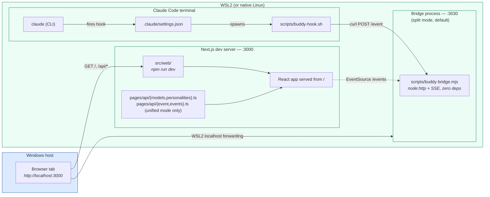
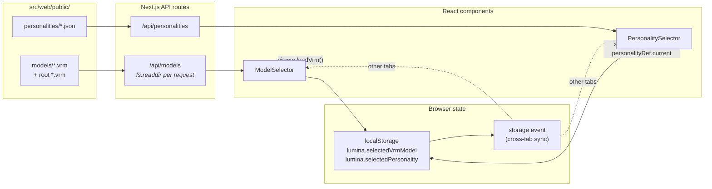

# Architecture

Two diagrams: runtime topology and event data flow. Plus a file-to-responsibility table.

For installation flow specifically — happy path, failure branches, and the four health signals — see [`install-flow.md`](install-flow.md).

## 1. Runtime topology

Where each process actually lives, and how the browser reaches it.



**Key facts the diagram encodes:**

- **Everything except the browser runs in WSL.** There is no Windows-side service. The browser reaches WSL services through WSL2's automatic localhost forwarding (kernel pipe, not LAN). No firewall rules required.
- **Two ports**, both inside WSL: 3000 (Next.js) and 3030 (bridge, split mode only).
- **In `unified` mode**, the bridge endpoints `/api/event` and `/api/events` live inside the Next.js process; port 3030 is unused. See `docs/bridge-modes.md`.

## 2. Event data flow (deep integration)

What happens when Claude does a thing.

```mermaid
sequenceDiagram
    autonumber
    participant Claude as Claude Code (WSL)
    participant Hook as buddy-hook.sh
    participant Bridge as buddy-bridge.mjs<br/>(:3030)
    participant Client as buddyEvents.ts<br/>(in browser)
    participant View as VRM scene<br/>+ AssistantText

    Claude->>Hook: Tool call begins; harness pipes hook<br/>JSON to stdin, runs buddy-hook.sh PostToolUse
    Hook->>Hook: parse tool_name, session_id<br/>build envelope (python3 if available)
    Hook->>Bridge: POST /event { type, tool, session, context }<br/>(curl --max-time 1, exit 0 always)
    Bridge->>Bridge: prepend ts, JSON-encode
    Bridge-->>Client: SSE: data: { ts, type, tool, ... }
    Client->>Client: REACTIONS[type]<br/>→ tool override<br/>→ language override (from context.tool_input.file_path)<br/>→ personality override (from personalityRef.current)
    Client->>View: emoteController.playEmotion(emotion)
    Client->>View: onMessage(line) → setAssistantMessage
    Note over View: 4s auto-clear timer<br/>silenced if chatProcessing or isAISpeaking
```

**Resolution priority for each event** (last match wins per axis):

- **Emotion**: base `REACTIONS[type].emotion` → `LANGUAGE_REACTIONS[lang].emotion` → `personality.defaultEmotion` (only if no language match)
- **Line**: base → `tool` override → `language` override → personality override (`lang.<id>` ▸ `tool.<name>` ▸ event name)

Source of truth for both axes: `src/web/src/features/buddyEvents/buddyEvents.ts`.

## 3. User-facing controls (orthogonal to events)



- **Auto-discovery**: drop a `.vrm` in `public/models/`, refresh tab, it's in the dropdown. Same for `.json` in `public/personalities/`.
- **Persistence**: choices live in `localStorage`. Survives reload, cross-syncs to other tabs through the `storage` event (browser native, no bridge involvement).
- **Personality changes don't reconnect SSE**: `buddyEvents.ts` reads `personalityRef.current` on every event, so switching is instant.

## 4. File-to-responsibility map

| File | Lives in | Responsibility |
|------|----------|----------------|
| `src/launcher/Program.cs` | Windows C# process | Split-window launcher; starts WSL services; bridge watchdog; window prefs |
| `src/terminal/server.mjs` | WSL Node process | node-pty WebSocket server :3031; bridges Claude Code CLI ↔ xterm.js |
| `scripts/up.sh` | WSL invocation | Sanity checks, bridge + dev server (foreground, Ctrl+C stops both) |
| `scripts/buddy-bridge.mjs` | WSL Node process | SSE relay; `POST /event`, `GET /events`, `GET /health` |
| `scripts/buddy-hook.sh` | invoked by Claude Code per hook | Envelope-and-forward to bridge; **always exits 0** |
| `scripts/start-bridge.sh` | WSL, idempotent | Starts bridge via systemd-run; no-op if already running |
| `scripts/start-dev.sh` | WSL, idempotent | Detects /mnt/d/, rsyncs to ~/lumina-runtime/, starts Next.js |
| `scripts/start-terminal.sh` | WSL, idempotent | Starts node-pty terminal server via systemd-run |
| `scripts/status-bridge.sh` | WSL, polling loop | Reads ccusage statusline every 5s; posts [Task]/[Scope]/[TODO] to bridge |
| `start-Lumina.bat` | Windows Explorer | Double-click launcher — starts `src/launcher/publish/LuminaLauncher.exe` |
| `~/.claude/settings.json` | global Claude Code config | Absolute-path hook bindings for all Claude Code sessions on this machine |
| `.claude/settings.json` | project Claude Code config | Project-level hooks (kept for dev sessions inside repo) |
| `src/web/src/features/buddyEvents/buddyEvents.ts` | runs in browser | EventSource client; REACTIONS/GIT_REACTIONS/LANGUAGE_REACTIONS all locale-aware via L() |
| `src/web/src/components/settingsPanel.tsx` | runs in browser | Purple settings panel: 角色/人格/效能/語言/Hooks/ConversationLog |
| `src/web/src/components/demoPanel.tsx` | runs in browser | Interactive demo panel — 6 categories, all effects testable without Claude Code |
| `src/web/src/components/statusPanel.tsx` | runs in browser | Shows [Task]/[Scope]/[TODO] from StatusUpdate events; auto-hides after 30s |
| `src/web/src/components/buddyLog.tsx` | runs in browser | Persistent Buddy Log — all VRM messages with timestamps; clearable |
| `src/web/src/components/{modelSelector,personalitySelector}.tsx` | runs in browser | Auto-discovery dropdowns; i18n name support (name_en, name_ja) |
| `src/web/src/components/statusBar.tsx` | runs in browser | Live Web :3000 / Bridge :3030 status dots; click down indicator to restart |
| `src/web/src/components/vrmViewer.tsx` | runs in browser | Loads VRM via resolution chain (localStorage → env → /avatar.vrm → IPFS) |
| `src/web/src/pages/api/models.ts` | Next.js server | `fs.readdir(public/models/)` and `public/` root, Cache-Control: no-store |
| `src/web/src/pages/api/personalities.ts` | Next.js server | Parses each .json; includes name_en/name_ja for i18n |
| `src/web/src/pages/api/hooks.ts` | Next.js server | GET/POST to install or uninstall global hooks in ~/.claude/settings.json |
| `src/web/src/pages/api/restart-bridge.ts` | Next.js server | POST to re-run start-bridge.sh from the browser |
| `src/web/src/pages/index.tsx` | runs in browser | Main compositor — all feature states, effect dispatch, bridge event routing |

## 5. Differences from the architecture diagrams floating around in chat

For posterity — these things appear in third-party "Buddy architecture" diagrams but are **not** in Lumina:

| Often shown | Reality |
|-------------|---------|
| Windows-side Bridge Server with `New-NetFirewallRule` | No Windows-side service exists. Bridge is in WSL. WSL2 localhost forwarding handles the browser. |
| `buddy-config.json` as Single Source of Truth | Selections live in browser `localStorage` (per-machine, per-browser-profile). No filesystem state. |
| `get-host-ip.sh` to resolve Windows host IP | Wrong direction — we don't initiate WSL→Windows traffic. |
| Express + ws + body-parser in the bridge | `node:http` only, ~110 lines. Zero npm deps. |
| MCP (Model Context Protocol) server | Not used. Hooks are passive observation; MCP is for tools the model invokes deliberately. |
| `scan-models.js` writing `models-config.json` | `pages/api/models.ts` reads `public/models/` per request. No build step. |
| Polling loop on the client | SSE with `EventSource`. Browser-native reconnect + 5s explicit backoff. |
| FPS limiter at 30/15 on focus/blur | Browser auto-throttles `requestAnimationFrame` on hidden tabs. Hard cap unnecessary. |

Each was examined and rejected with reasoning that's now in `docs/edge-cases.md`, `docs/bridge-modes.md`, and `docs/bootstrap-prompts.md`.
